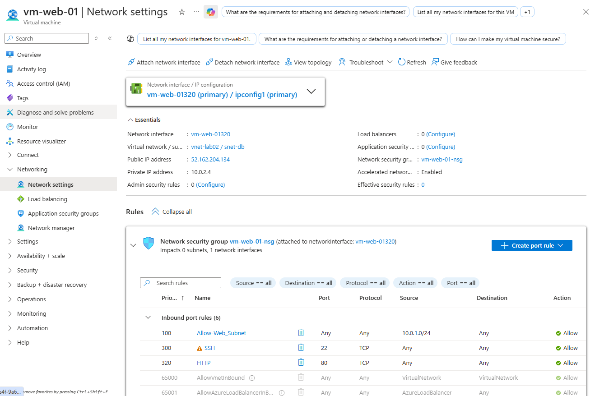
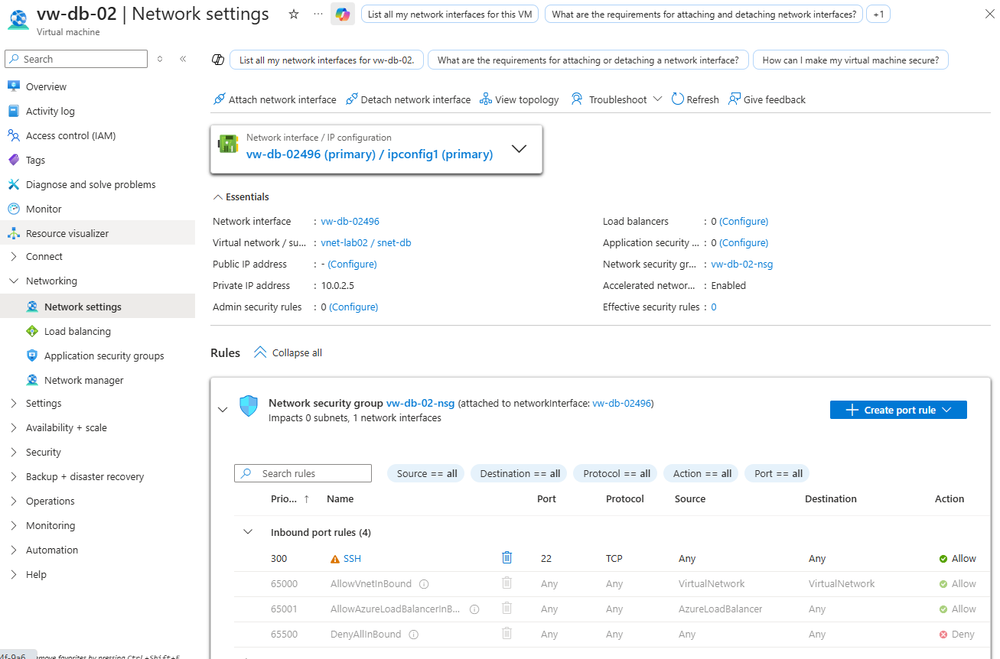

# Lab 02 - Building a Secure 2-Tier Web Application

## Objective
This lab demonstrates how to build a secure 2-tier web application architecture in Azure using Infrastructure as a Service (IaaS). I created a virtual network with a public subnet for a web server and a private subnet for a database server. I then configured Network Security Groups (NSGs) to control traffic so the database server was not exposed to the internet.

## Architecture
- Resource Group: `RG-laba02`
- Virtual Network: `vnet-lab02`
- Web Subnet: `snet-web` (`10.0.1.0/24`)
- DB Subnet: `snet-db` (`10.0.2.0/24`)
- Web VM: `vm-web-01`
- DB VM: `vm-db-01`

## Deployment Steps

### 1. Created the Network Foundation
I created a virtual network named `vnet-lab02` with the address space `10.0.0.0/16`. Inside the virtual network, I created two subnets:
- `snet-web` with range `10.0.1.0/24`
- `snet-db` with range `10.0.2.0/24`

### 2. Deployed the Web Server
I created `vm-web-01` in the `snet-web` subnet. This VM was configured with Ubuntu Linux, a public IP address, and inbound rules for SSH on port 22 and HTTP on port 80.

### 3. Deployed the Database Server
I created `vm-db-01` in the `snet-db` subnet. This VM was configured without a public IP address so it stays private and can only be reached internally.

### 4. Validated Internal Connectivity
I connected to `vm-web-01` using SSH from my local machine. From inside the web server, I tested connectivity to `vm-db-01` using its private IP address. This confirmed both VMs could communicate over the virtual network.

### 5. Configured Security Rules
I configured Network Security Groups so the web VM could accept public traffic on ports 22 and 80, while the database VM only allowed inbound traffic from the web subnet range `10.0.1.0/24`.

## Security Outcome
This architecture improves security by exposing only the web server to the internet while keeping the database server private. Network segmentation and NSG rules help limit unnecessary access between systems.

## Screenshots

### Web VM

### DB VM

## What I Learned
This lab helped me better understand Azure virtual networks, subnetting, Linux virtual machines, SSH connectivity, NSG rules, and how to build a more secure 2-tier cloud design.

## Cleanup
After completing the lab, the resource group can be deleted to avoid unnecessary charges.
